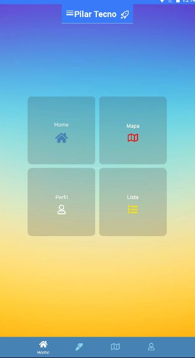
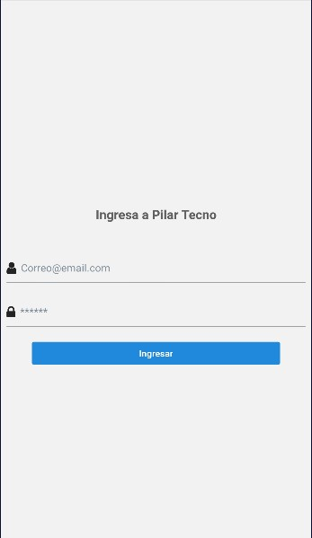
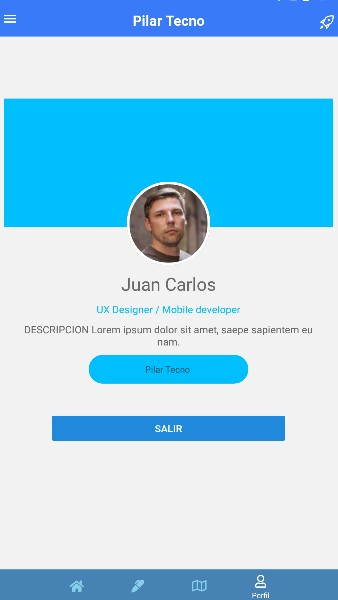

# PilarTecnoMobile
Pilar Tecno App 

# Actividad 2:

## PilarTecnoMobile
Pilar Tecno App 

### 1   -> *Integrar redux como se indica en la guía.

### 2   -> *Crear la botonera con 4 pestañas

### 3  -> *crear pantalla login con un formulario

### 4 ->   *En la pantalla de perfil incluir datos de usuario

