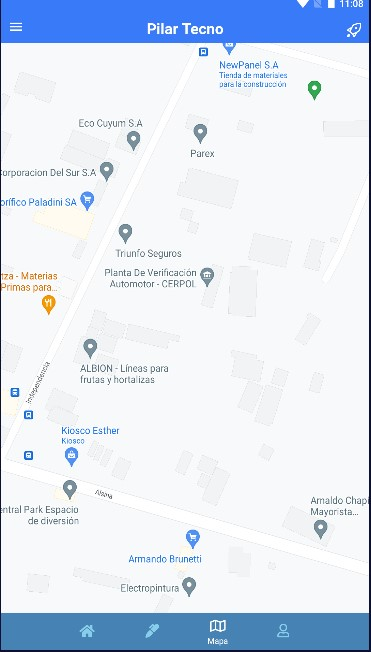
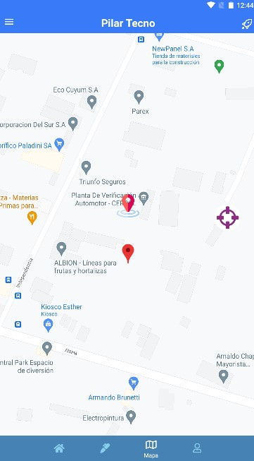
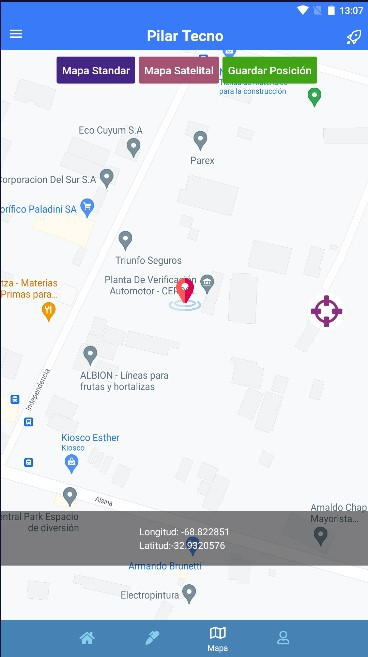
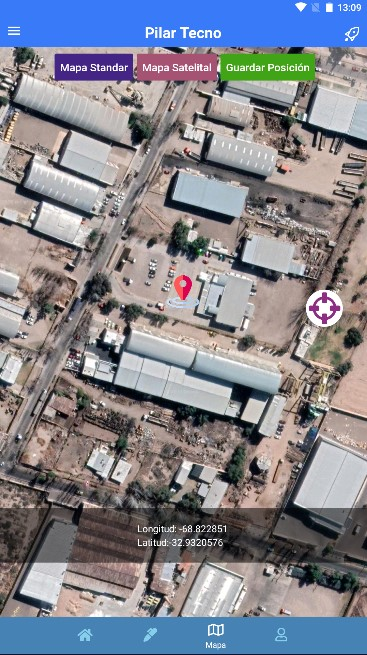
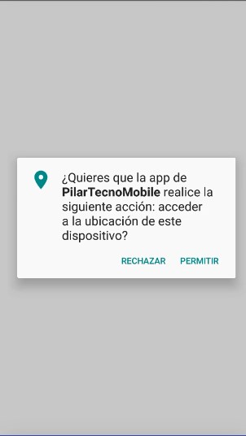

# PilarTecnoMobile
Pilar Tecno App 

# Actividad 4:

### 1   -> *INSTALL DEPENDENCIAS.

-> npm install react-native-maps --save-exact
-> npm install react-native-geolocation-service

### 2   -> * Implementar pantalla Mapa.

### 3  -> * Renderizar en el mapa implementando un pickaper de ubicacion.'.

### 4 ->  * 2-boton para cambiar el tipo de mapa + 1-boton guardar ubicacion.'

### 5 ->  * solicitud de permisos de geolocalizacion'.

/*---------------TASK FINISH.js---------------------*/
