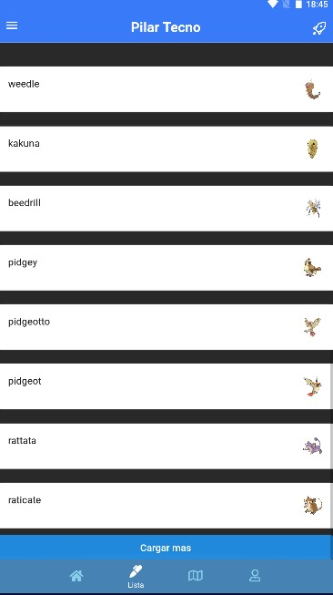
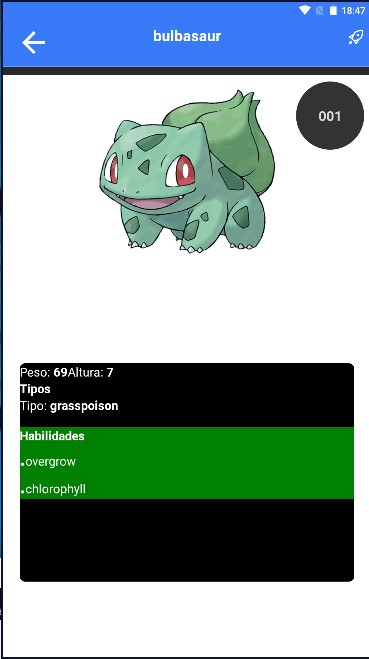

# PilarTecnoMobile
Pilar Tecno App 

# Actividad 3:

### 1   -> *INSTALL DEPENDENCIAS.

### 2   -> *interfax api rest.
-> consultar https://pokeapi.co/api/v2/

-> crear carpeta api -> index.js -> funsiones y variables

- const: BASE_URL, IMG_URL.
- metodo: getPokemonList //get all pokemons
- metodo: getPokemon //get pokemon by Id

### 3  -> *listado de recursos mediante get.
-> componentes de react-native:- FlatList // recorrer listar
-> componentes de react-native-elements:-  ListItem  // listar elemetos

### 4 ->   *show item pasar props entre componentes.
-> componentes de react-native:- ScrollView //expandir lista
-> navegation: <Header leftIcon='arrow-back' title={pokemon?.name} leftAction={() => props.navigation.goBack()} />
->collapsible //Componente para listas

### 5 -> **Metodo RefreshContol, metodo getMores, componente ActivityIndicator.'

/*---------------TASK FINISH.js---------------------*/
