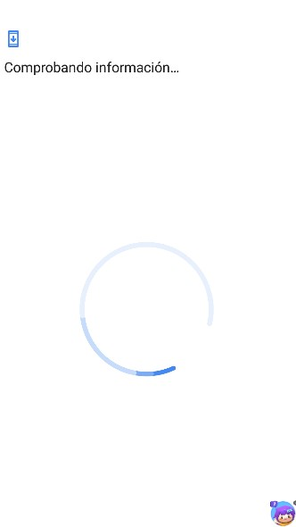
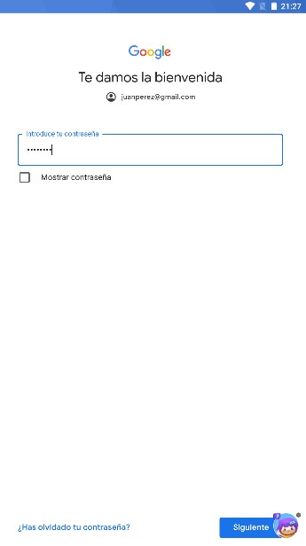
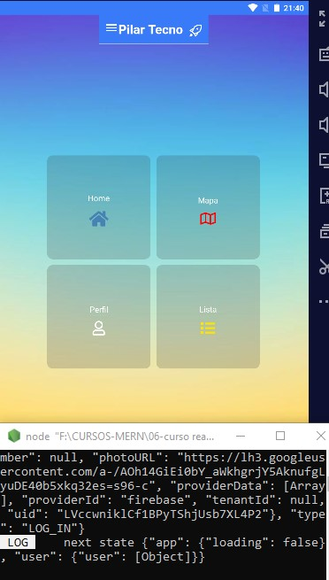
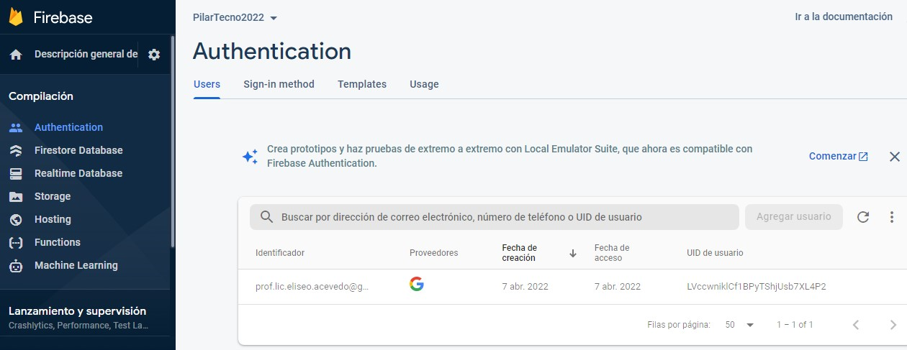

# PilarTecnoMobile
Pilar Tecno App 

# practica con FIREBASE:

### 1   -> *INSTALL DEPENDENCIAS.
### 2   -> * Autenticación  Proceso de ingreso a la app '

### 3   -> git commit -m '3-> * Autenticación escucha activa de sesión '
### 4   ->  *** FALTA: Autenticación  Proceso de salida de la app (NO LLEGUE CON EL TIEMPO) *** '

/*---------------TASK FINISH.js---------------------*/
